# Structure de la demande politique — prototype sur données simulées

Tout ce qui suit est **entièrement simulé**. Les positions des partis, les poids des clusters
d'électeurs, les scores : rien n'est une estimation. Le but est de fixer le langage visuel et les
quantités qu'on chercherait ensuite à estimer sur données réelles, et de juger si l'objet mérite
d'être construit.

`simulate.py` génère les données et les douze figures (`figures/`), plus `resultats_simules.json`.
Environ 45 secondes d'exécution, dépendances : numpy, scipy, matplotlib.

---

## 1. Ce que je comprends du projet

Un simulateur électoral classique part des partis et prédit des sièges. Ici on part des
**électeurs**, représentés comme une distribution dans un espace idéologique à deux dimensions, et
on pose trois questions distinctes qu'un score électoral confond :

1. **Quelle est la taille du marché** d'une offre donnée, c'est-à-dire la masse d'électeurs situés
   près d'une position, indépendamment de qui occupe cette position ?
2. **Quelle part de ce marché un parti capte-t-il**, compte tenu de sa position, de la largeur de son
   bassin, de sa force propre, et surtout de la présence de concurrents proches ?
3. **Comment la distribution des électeurs se déforme-t-elle dans le temps**, en gardant des zones
   de référence fixes pour que la comparaison ait un sens ?

La séparation entre 1 et 2 est le cœur du projet. Elle permet d'écrire des phrases du type « le
marché de la droite libérale-conservatrice s'est contracté, indépendamment de ses candidats » ou
« Reconquête a un score de 6 % mais un marché accessible de 15 %, dont la moitié est captée par le
RN ». Le modèle ne doit pas imposer ces conclusions ; il doit permettre de les tester.

Un point de méthode que le prototype rend visible : ce que j'appelle « marché » est toujours un
**contrefactuel** (que se passerait-il si ce parti était seul ?). Il n'est donc jamais observé
directement ; il se déduit d'un modèle de choix estimé. C'est la principale chose à estimer avec de
vraies données, voir §5.

## 2. Variables simulées

**Espace.** Chaque électeur $i$ a une position $z_i = (E_i, C_i)$, chaque coordonnée sur $[-3, +3]$.

- $E$ : économie. $E < 0$ interventionnisme, redistribution, protection ; $E > 0$ libéralisme économique.
- $C$ : culture. $C < 0$ progressisme, libéralisme culturel ; $C > 0$ conservatisme, autorité, ordre.

Le quadrant haut-droit est donc libéral-conservateur, le quadrant haut-gauche
interventionniste-conservateur, le bas-gauche gauche progressiste, le bas-droit social-libéral.

**Électeurs.** À chaque date $t \in \{1995, 2000, \dots, 2025\}$, $N = 20\,000$ électeurs sont tirés
d'un **mélange de six gaussiennes 2D** :

$$D_t(z) = \sum_{k=1}^{6} w_{k,t} \, \mathcal{N}(z \mid m_{k,t}, S_{k,t})$$

Chaque cluster a un centre $m_k$, une matrice de covariance $S_k$ (deux écarts-types et une
corrélation interne) et un poids $w_k$. Tous ces paramètres sont donnés en 1995 et en 2025 et
interpolés linéairement entre les deux. Les six clusters : gauche radicale progressiste ; gauche
modérée ; centre social-libéral ; libéral-conservateur ; national-interventionniste ; un cluster
diffus au centre. Le scénario illustratif fait passer le poids du cluster libéral-conservateur de
30 % à 13 % et celui du cluster national-interventionniste de 10 % à 28 %, tout en le déplaçant vers
la gauche économique ($E$ de +0,1 à −0,8).

**Partis.** Six partis fictifs à positions inspirées du paysage 2025, chacun défini par trois objets :

| | centre $\mu_p$ | largeur (écarts-types) | valence $V_p$ |
|---|---|---|---|
| LFI | (−2,0 ; −1,3) | 0,75 × 0,85 | 1,00 |
| PS | (−1,0 ; −0,9) | 0,80 × 0,80 | 0,70 |
| Renaissance | (+1,0 ; −0,5) | 0,90 × 0,90 | 0,95 |
| LR | (+1,5 ; +1,0) | 0,80 × 0,75 | 0,65 |
| RN | (−0,4 ; +1,8) | 1,00 × 0,80 | 1,20 |
| Reconquête | (+0,6 ; +2,2) | 0,80 × 0,70 | 0,50 |

L'offre est **maintenue fixe à sa configuration 2025** pour toutes les dates. C'est volontaire : on
isole ainsi l'effet de la seule transformation de la demande. Avec de vraies données, les partis
bougent aussi, et il faudra les deux.

## 3. Méthode

**Attraction.** L'attraction du parti $p$ sur un électeur en $z$ est un noyau gaussien pondéré par
la valence :

$$A_p(z) = V_p \exp\!\left(-\tfrac12 (z-\mu_p)' \Sigma_p^{-1} (z-\mu_p)\right)$$

$\Sigma_p$ contrôle la largeur du bassin (un parti « large » attire loin de son centre), $V_p$ sa
capacité de conversion à distance idéologique donnée (leader, crédibilité, dynamique).

**Choix.** La probabilité de vote suit une règle de parts avec une **option extérieure**
(abstention) d'attraction constante $A_0$ :

$$P(p \mid z) = \frac{A_p(z)}{A_0 + \sum_q A_q(z)}, \qquad P(\text{abst} \mid z) = \frac{A_0}{A_0 + \sum_q A_q(z)}$$

Ce n'est pas une règle ad hoc : c'est exactement un **logit multinomial** dont l'utilité vaut
$\ln V_p - \tfrac12 d_p(z)^2$, avec $d_p$ la distance de Mahalanobis au parti. Cela compte pour la
suite, parce que ce modèle s'estime par maximum de vraisemblance sur des données individuelles de
vote. L'option extérieure est indispensable : sans elle, un électeur loin de tout le monde serait
attribué avec probabilité 1 au parti le moins éloigné, et la notion d'espace vacant n'aurait aucun
sens. $A_0$ est calibré pour une abstention simulée de 32 %.

**Densité.** $D_t$ est estimée par noyau (KDE) sur l'échantillon, comme on le ferait sur une enquête.

**Trois tailles pour un parti**, toutes en % de l'électorat :

- *score* : $\frac1N \sum_i P(p \mid z_i)$, en présence de tous les concurrents ;
- *cœur* : part des électeurs à distance de Mahalanobis $d_p \le 1$ du centre — pure géométrie ;
- *marché accessible* : part qui voterait $p$ s'il était **seul face à l'abstention, à valence de
  référence** $V = 1$. Il mesure la position et la largeur, pas la popularité du moment.

L'écart entre marché accessible et score se décompose en ce qui va aux concurrents et ce qui reste
dans l'abstention (figure 4, panneau droit) : pour chaque électeur du marché accessible de $p$,
pondéré par sa probabilité d'y appartenir, on regarde où il vote réellement.

**Familles idéologiques.** Quatre rectangles **fixes** de l'espace ; le potentiel d'une famille à la
date $t$ est la part des électeurs dans son rectangle. Les rectangles ne se touchent pas et laissent
le centre non attribué, donc les parts ne somment pas à 100 %.

**Chevauchement.** $O_{pq} = \sum_i \min(k_p(z_i), k_q(z_i)) \big/ \sum_i k_p(z_i)$, avec $k$ le noyau
sans valence : part du marché idéologique de $p$, pondéré par la densité réelle, que $q$ peut aussi
atteindre. Asymétrique par construction.

**Territoires.** En chaque point de la grille, parti dominant $= \arg\max_p P(p \mid z, \text{vote})$,
et marge sur le second, qui pilote l'opacité.

**Espace vacant.** $U(z) = D(z)\,[1 - \max_p P(p \mid z)]$, avec l'option extérieure dans $P$.

**Entrant optimal.** Pour chaque position candidate, part de l'électorat qu'obtiendrait un parti de
largeur et de valence moyennes ajouté à l'offre existante ; recherche sur grille.

## 4. Les graphiques

Sous chaque figure : ce qu'elle montrerait si les données étaient réelles.

### Figure 1 — La carte
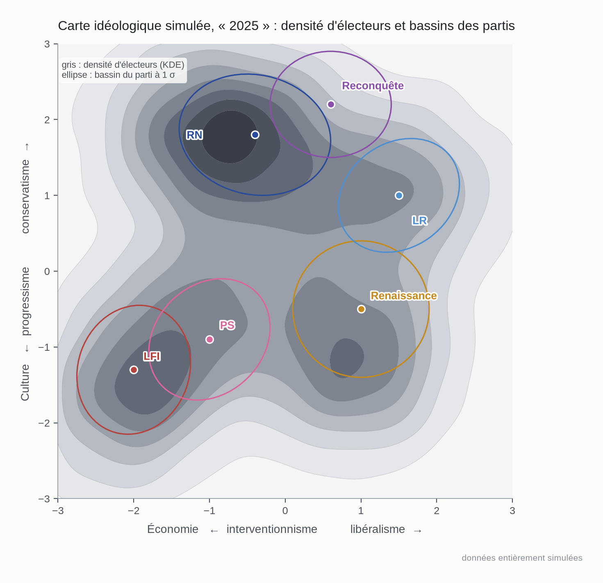

C'est le graphique qui doit faire comprendre le projet d'un coup d'œil. Avec de vraies données, le
gris serait la densité des électeurs auto-positionnés (ou positionnés par un modèle de mesure) sur
les deux axes, et chaque ellipse le bassin estimé d'un parti — sa taille dirait à quelle distance
idéologique il recrute encore. On verrait immédiatement si un parti est posé sur une masse ou dans
un creux, et où les bassins se recouvrent. Ici, RN, Reconquête et LR se chevauchent sur le
quadrant conservateur, ce que la figure 5 quantifie.

### Figures 10 à 12 — Les électeurs eux-mêmes
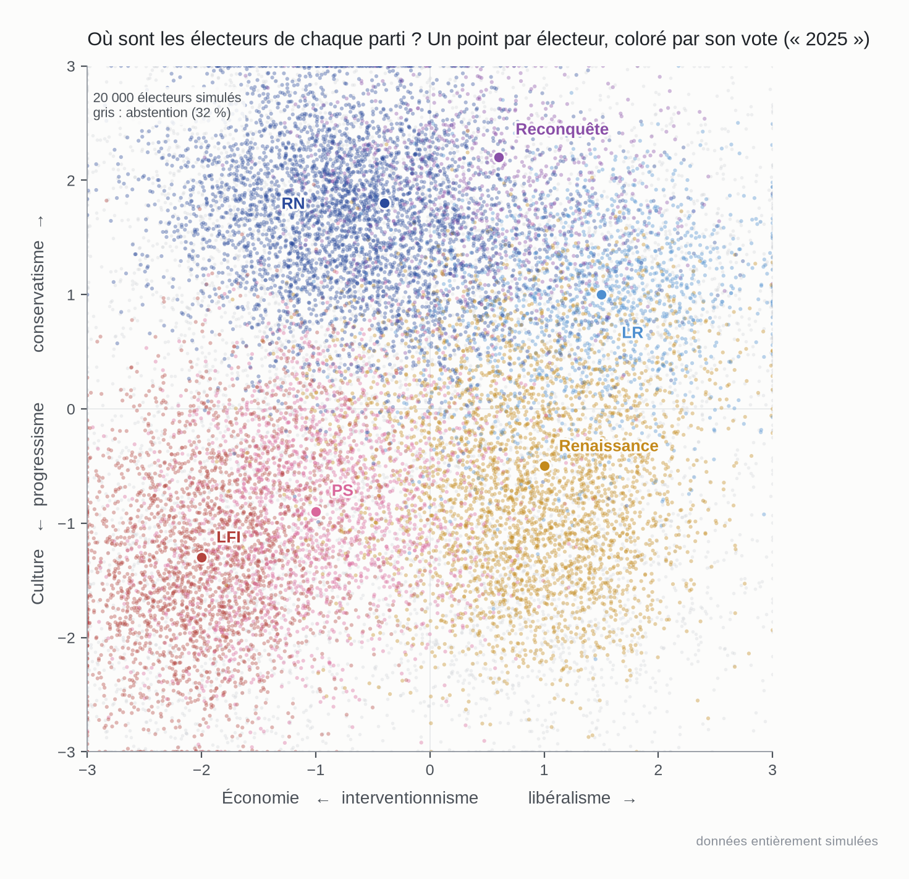

Un point par électeur, coloré par son vote, abstention en gris ; la superposition fait la saillance.
Avec de vraies données, c'est la forme la plus proche de l'observation brute : chaque point serait un
répondant auto-positionné, coloré par son vote déclaré, et la « tache » de chaque parti apparaîtrait
sans aucun lissage. Les zones de mélange de couleurs sont les zones de concurrence — ici la bande
RN / Reconquête / LR en haut à droite, et la zone PS / Renaissance au centre.

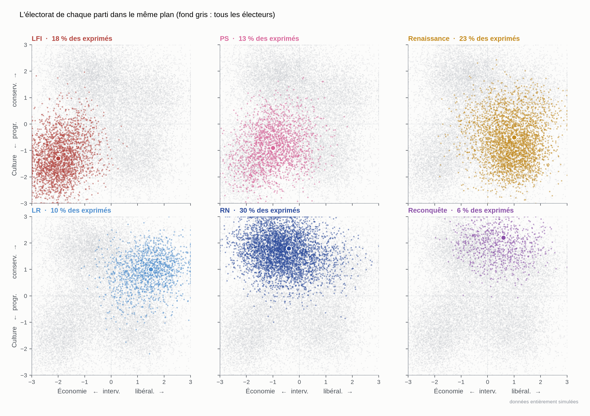

Même nuage, un panneau par parti, fond gris pour l'ensemble. Avec de vraies données, on comparerait
directement l'étendue de chaque électorat : LFI compact, Renaissance large, LR et Reconquête
dispersés dans une zone que le RN occupe densément. C'est la version « à l'œil » de la matrice de
chevauchement.

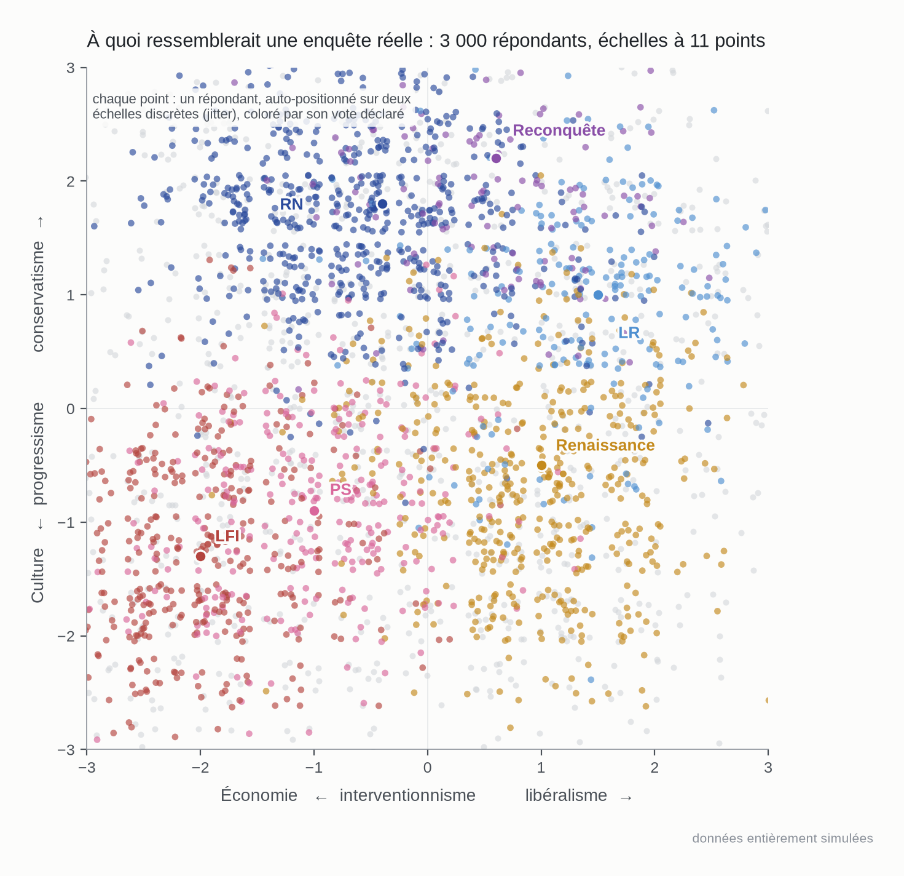

Ce que donnerait une enquête réelle : 3 000 répondants au lieu de 20 000, positions sur des échelles
discrètes à 11 modalités, jitter pour dé-superposer. La grille apparaît ; c'est le problème concret
des auto-positionnements d'enquête, et la raison pour laquelle le lissage (KDE) ou le hexbin restent
utiles pour les cartes de densité, même si le nuage brut reste la meilleure vue pour les électorats.

### Figure 2 — Quatre dates
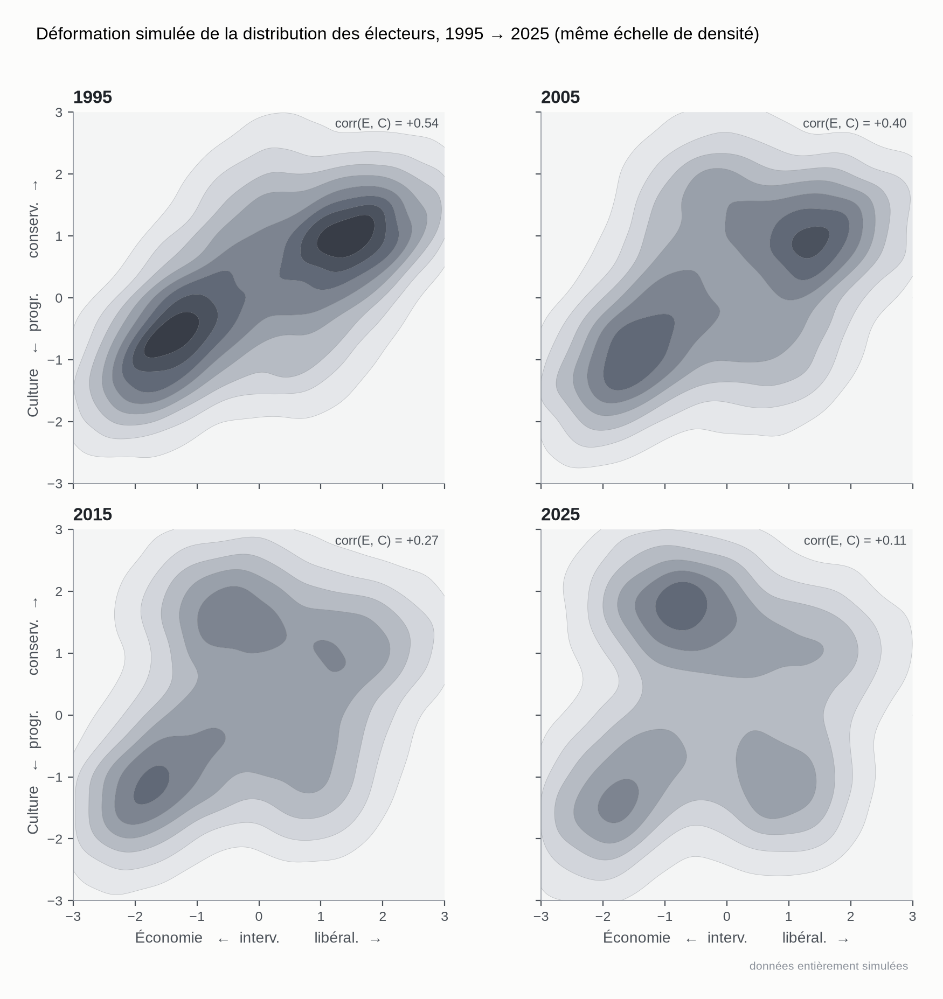

Même échelle de densité aux quatre dates. Avec de vraies données, ce panneau montrerait si la masse
libérale-conservatrice s'est réellement contractée et si une masse interventionniste-conservatrice a
grossi, ou au contraire si la distribution est stable et si tout le changement vient de l'offre.
C'est le test le plus direct de l'hypothèse « demande » contre l'hypothèse « offre ». La condition
sine qua non : des items d'enquête comparables d'une vague à l'autre.

### Figure 3 — Potentiel des familles
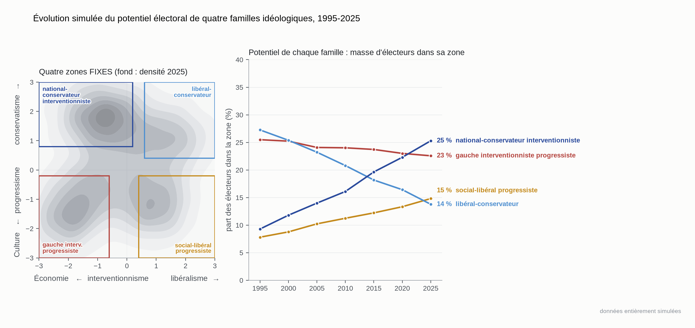

Zones fixes, masse variable. Avec de vraies données, la courbe bleu clair dirait si le déclin de la
droite traditionnelle est un problème de marché (la zone se vide) ou de captation (la zone est
pleine mais LR n'y prend plus rien). Le choix des rectangles est arbitraire et doit être fixé avant
de regarder les résultats, puis soumis à des tests de robustesse ; ce qui compte est qu'ils ne
bougent pas dans le temps.

### Figure 4 — Potentiel contre score
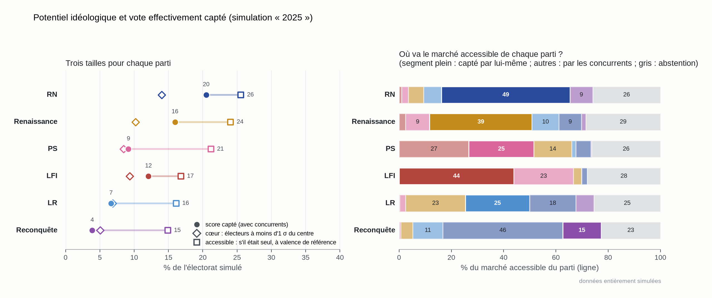

Le panneau gauche donne pour chaque parti ses trois tailles. Le panneau droit dit où va son marché
accessible. Avec de vraies données, c'est ici qu'on lirait des phrases comme « Reconquête capte 15 %
de son marché accessible, le RN en prend 46 % » ou « LR a un marché accessible de 16 % de
l'électorat mais en convertit un quart, Renaissance et le RN se partageant le reste ». Le panneau
droit est aussi une carte des transferts potentiels : ce qu'un parti gagnerait si son voisin
disparaissait.

### Figure 5 — Qui concurrence qui

Matrice asymétrique : la ligne est le marché, la colonne le concurrent qui peut l'atteindre. Avec de
vraies données, elle identifierait les paires en concurrence directe (ici Reconquête → RN à 80 %,
LFI ↔ PS à plus de 50 %) et les paires qui ne se disputent presque personne malgré une proximité sur
un seul axe (LFI → RN : 3 %, parce que l'écart culturel l'emporte). L'asymétrie est informative :
le RN atteint 80 % du marché de Reconquête, Reconquête 40 % de celui du RN.

### Figure 6 — Territoires
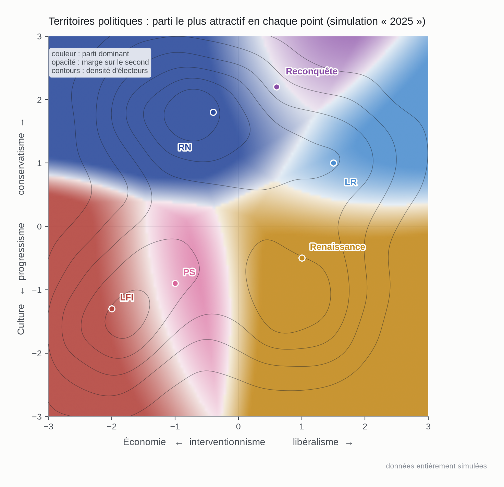

Parti dominant en chaque point, opacité proportionnelle à la marge. Avec de vraies données, les
zones pâles seraient les vraies frontières électorales — là où la compétition est intense et où un
petit déplacement d'offre fait basculer des électeurs. Les contours de densité rappellent qu'une
frontière ne compte que si des électeurs y vivent : la frontière RN/LR traverse une zone peuplée,
la frontière Renaissance/LR beaucoup moins.

### Figure 7 — Espace mal représenté
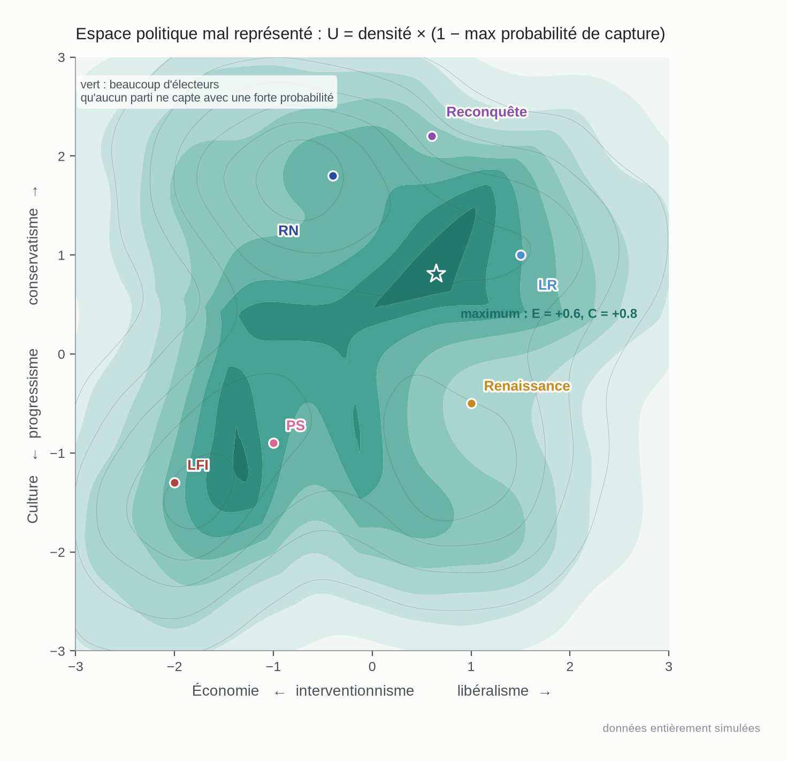

Densité multipliée par un moins la meilleure probabilité de capture. Avec de vraies données, le
maximum de cette surface répondrait à « où est le plus gros marché électoral actuellement mal
servi ? ». Ici il tombe entre Renaissance, LR et RN, dans une zone de conservatisme modéré et
d'économie centriste — et non là où la densité est maximale, parce que le RN y capte déjà beaucoup.
Une seconde poche apparaît entre LFI et PS.

### Figure 8 — Position optimale d'un nouvel entrant
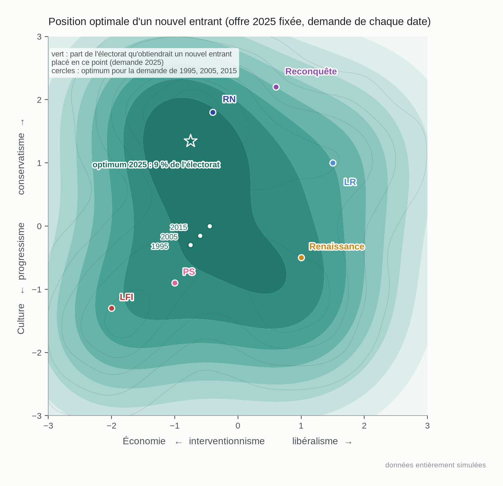

Part de l'électorat qu'obtiendrait un parti moyen ajouté à l'offre, en chaque point. Avec de vraies
données, on suivrait l'optimum d'une élection à l'autre. Deux enseignements du prototype à retenir
pour la suite. D'abord, l'optimum de l'entrant n'est **pas** le maximum de l'espace vacant : un
entrant de largeur moyenne gagne plus en mordant sur une masse dense déjà disputée qu'en occupant
un creux peu peuplé — ce sont deux questions différentes, et il faudra rapporter les deux. Ensuite,
la surface est plate et multimodale : l'optimum saute d'une date à l'autre entre des positions
quasi équivalentes, ce qui interdit de le présenter comme un point sans intervalle de confiance.

### Figure 9 — Corrélation économie / culture
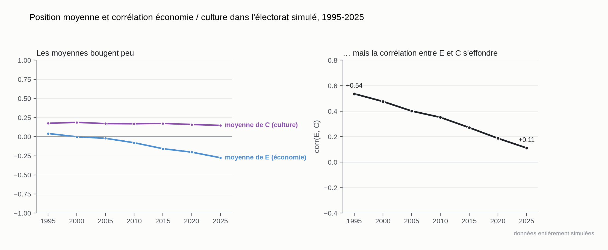

Les moyennes bougent peu ; la corrélation entre les deux axes passe de +0,54 à +0,11. Avec de
vraies données, c'est le test de l'hypothèse selon laquelle la transformation française n'est pas
un déplacement de la moyenne mais un **découplage** des deux dimensions : la droite économique
cesse d'impliquer le conservatisme culturel, et réciproquement. Si c'est vrai, les partis alignés
sur l'ancienne diagonale (LR, PS) voient leur marché se vider par construction, sans avoir bougé.

## 5. What this prototype suggests we should estimate with real data

Le prototype montre que toutes les quantités intéressantes dérivent de trois objets. Ce sont eux
qu'il faut estimer, dans cet ordre.

**1. La distribution des électeurs $D_t(E, C)$, comparable dans le temps.** C'est la contrainte
la plus dure. Il faut des enquêtes post-électorales successives avec des items assez proches pour
construire les deux axes par un modèle de mesure commun (analyse factorielle ou IRT avec ancrage
entre vagues), et tester l'invariance de mesure avant toute comparaison. Sans cela, les figures 2,
3 et 9 ne veulent rien dire : un changement d'items se lirait comme un changement d'opinion. C'est
exactement le problème de raccordement rencontré sur les enquêtes PISA dans l'autre projet, et il
doit être traité avec la même méfiance.

**2. Les paramètres des partis $(\mu_p, \Sigma_p, V_p)$ et l'option extérieure $A_0$.** Le modèle de
choix est un logit multinomial à perte quadratique ; ses paramètres s'estiment par maximum de
vraisemblance sur les votes individuels déclarés, avec l'abstention comme alternative. $V_p$ est
l'ordonnée à l'origine propre au parti, $\Sigma_p$ le poids de la distance sur chaque axe, $\mu_p$
soit fixé par une source externe (positions perçues, enquêtes d'experts, programmes) soit estimé
conjointement. Deux choix de spécification à tester : perte quadratique contre perte linéaire, et
$\Sigma_p$ propre à chaque parti contre commune à tous.

**3. Les positions des partis dans le même espace que les électeurs.** Le prototype triche en
plaçant les partis dans l'espace des électeurs par hypothèse. Avec de vraies données, les positions
perçues par les électeurs eux-mêmes sont préférables aux positions d'experts, parce que c'est la
perception qui gouverne le vote.

Une fois ces trois objets estimés, tout le reste est du calcul : potentiels par famille, marchés
accessibles, taux de captation, matrice de chevauchement, espace vacant, entrant optimal — avec des
intervalles de confiance par bootstrap, indispensables vu la platitude des surfaces observée en
figure 8.

**La décomposition qui justifie le projet.** Le score d'un parti s'écrit
$S_{p,t} = M_{p,t} \times \kappa_{p,t}$, marché accessible fois taux de captation. Entre deux
dates, $\Delta \ln S_p = \Delta \ln M_p + \Delta \ln \kappa_p$ : la part du déclin de LR qui vient de
la contraction de son marché et celle qui vient d'une moindre captation (valence, concurrence). C'est
la phrase-cible du projet, et elle n'est calculable qu'avec les trois objets ci-dessus.

**Validation.** Le modèle doit prédire hors échantillon les scores d'une élection non utilisée pour
l'estimation. Un test plus exigeant : vérifier que le marché accessible d'une position à $t$ prédit
le succès d'un entrant qui l'occupe à $t+1$ — c'est le seul moyen de savoir si « potentiel » mesure
autre chose qu'une reconstruction a posteriori.

**Ce que le prototype ne règle pas.** Deux dimensions suffisent peut-être pour la France, peut-être
pas (Europe, écologie, rapport aux institutions). La valence $V_p$ absorbe tout ce qui n'est pas
spatial et variera fortement d'une élection à l'autre ; elle est le résidu du modèle, pas son
résultat. Et les positions des partis bougent aussi : la décomposition demande/offre devra faire
varier les deux, et la contribution de chacune n'est identifiée que si l'on accepte une forme
fonctionnelle.

## 6. Données réelles

Le dossier `donnees_reelles/` refait les figures 10 à 12 sur des enquêtes réelles :
CSES (France 2017 et 2012) et Baromètre de la confiance politique du CEVIPOF (décembre 2017,
janvier 2022, janvier 2024, janvier-février 2025), avec un point par répondant coloré par son
vote. Sources, construction des axes, résultats et limites sont documentés dans
`donnees_reelles/NOTE.md`. Le résultat principal : le nuage réel est allongé le long de la
diagonale interventionnisme-ouverture / libéralisme-fermeture (corrélation +0,3 à +0,4 selon la
vague), les électorats se recouvrent largement (le vote explique environ un tiers de la variance
sur chaque axe en 2017) et l'électorat Le Pen se situe au centre de l'axe économique.
